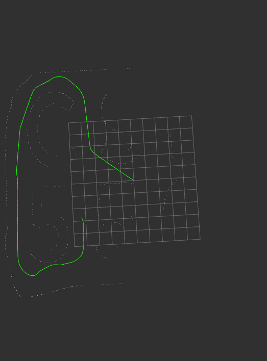

# littleslam_ros2


[LittleSLAM](https://github.com/furo-org/LittleSLAM.git) ROS2 wrapper.
# Install
```
cd ~/ros2_ws/src
git clone --recursive https://github.com/rsasaki0109/littleslam_ros2
cd ~/ros2_ws/
colcon build  
``` 

# Run  
```
ros2 run littleslam_ros2 littleslam_ros2  
```
# IO  
sub  
- sensor_msgs::msg::LaserScan ("scan")
- odom (tf2 "base_link"->"odom")(optional,with use_odom:=true)  

pub  
- sensor_msgs::msg::PointCloud2 ("icp_map")
- nav_msgs::msg::Path ("path")
- nav_msgs::msg::PoseStamped ("current_pose")

# Demo
data:[ros.org Introduction to Working With Laser Scanner Data](http://wiki.ros.org/laser_pipeline/Tutorials/IntroductionToWorkingWithLaserScannerData)

```
ros2 run littleslam_ros2 littleslam_ros2 /scan:=/base_scan
ros2 bag play -s rosbag_v2 Mapping1.bag
rviz2 -d config/demo.rviz
```

  

# Reference  
[Masahiro Tomono,『introduction to SLAM』](https://www.ohmsha.co.jp/book/9784274221668/)(in japanese)  
[LittleSLAM](https://github.com/furo-org/LittleSLAM.git)  
